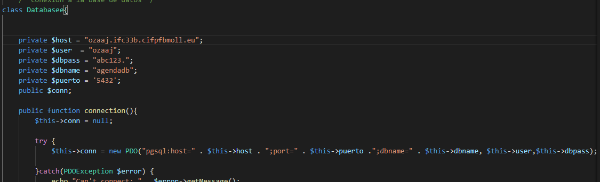

# Agenda Con Base de Datos

In this PHP practice, we needed to make a contact list with a connection to the database (postgres), and be able to do CRUD (Create, Read, Update, Delete).

## Configuration to the Databases

We need to add the configuration that will allow us to connect to the database, this file will be located in:

    Database\bd.php

## Second step

we need to create the database agendadb:

    CREATE DATABASE agendadb

Then we need to create the table contacts:

    CREATE TABLE IF NOT EXISTS contacts (
    contact_id SERIAL PRIMARY KEY,
    name VARCHAR(255) NOT NULL,
    phone_number VARCHAR(255) NOT NULL
    )
## Third step

after having the database and the table created, we can then start to use our contacts App through this link:

http://ozaaj.ifc33b.cifpfbmoll.eu/Agenda_DB/agendaConBD/agenda.php

If we want to use it in another database, we need to change the configuration in:

    Database\bd.php